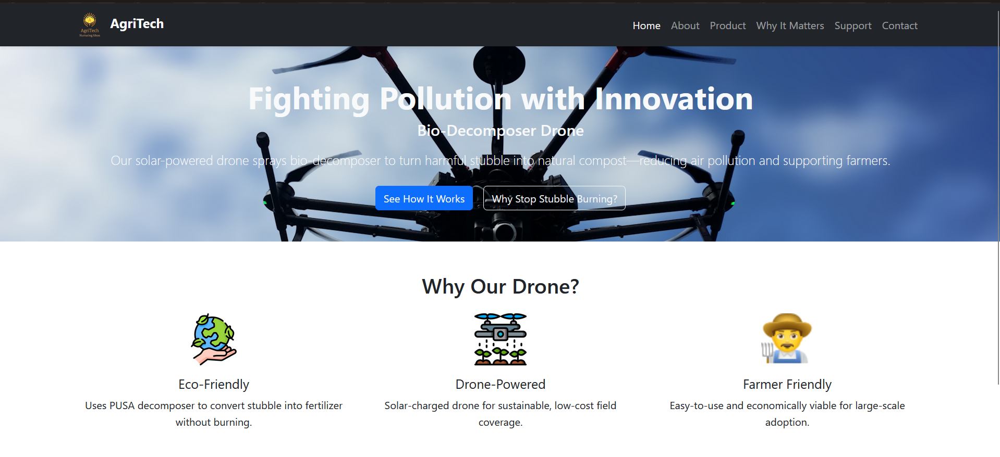

# 🌾 Bio-Decomposer Drone – Stubble Burning Solution

A web-based presentation of our drone innovation built to tackle the serious problem of stubble burning in India. Our solar-powered drone autonomously sprays PUSA bio-decomposer over crop residue, accelerating its decomposition and turning it into natural manure — helping reduce air pollution, improving soil health, and supporting farmers economically.

---

## 🚀 Project Overview

Stubble burning releases harmful pollutants like CO₂, SOx, and PM2.5, contributing to smog and climate change. This project showcases a cost-effective, scalable, and environmentally friendly drone solution developed by our team for a national-level innovation competition.

This website explains:

- 🌱 The **problem of stubble burning**
- 🚁 The **technical solution using drones**
- 🧪 The **benefits of bio-decomposition**
- 🧑‍🌾 How it **helps farmers and the environment**
- 📬 How to **contact and support** our mission

---

## 📸 Website Preview

  
_Responsive design compatible with mobile, tablet, and desktop._

---

## 🛠️ Tech Stack

- **HTML5** + **CSS3**
- **Bootstrap 5** for responsiveness
- **Custom Icons & Graphics**
- Fully static and hosted via GitHub Pages

---

## 🧠 Key Features

- 📱 Fully responsive UI
- 📊 Technical specs and data-backed content
- 💬 Contact form and support section
- 📚 Educational section on stubble burning impact

---

## 🧑‍💻 Contributors

- Anij Mehta – [GitHub](https://github.com/anij-mehta)

---

## 🤝 How to Support

We're open to:
- Collaborations
- Funding/partnerships for field deployment
- Volunteers for awareness and outreach

📧 Reach us at: [team@stubbledrone.org](mailto:team@stubbledrone.org)

---

## 📂 Repository Structure
stubble-burning-website/ 
├── index.html 
├── about.html 
├── contact.html 
├── product.html 
├── stubble.html 
├── support.html 
├── style.css 
└── images/ 
├── logo.png 
├── drone.jpg 
├── eco.png 
├── drone-icon.png 
├── farmer-icon.png 
├── member1.jpg ... 

---

## 🌐 Live Site

👉 [Visit the Project Website](https://anij-mehta.github.io/stubble-burning-website/)

---

## 📜 License

This project is for academic and awareness purposes. Contact us for reuse or collaboration.

